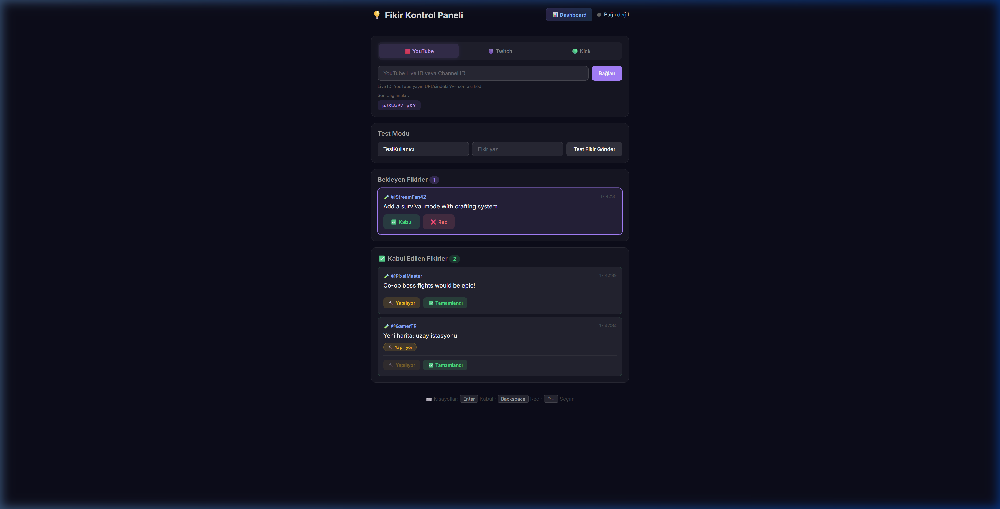
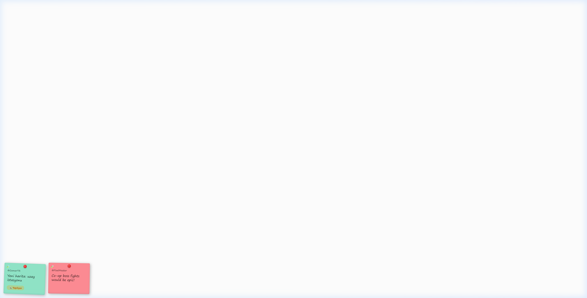
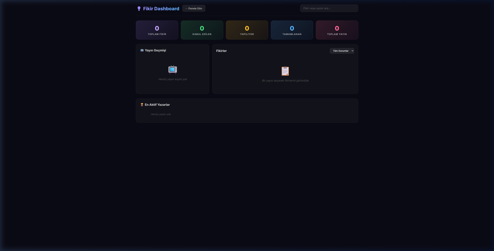

<div align="center">

# 💡 Fikir Overlay System

### Multi-Platform Live Stream Idea Overlay

[](https://nodejs.org)
[](#)
[](#)
[](#)
[](#)

**Viewers submit ideas in chat → Streamer manages them → Post-it overlay in OBS**

*Supports 30+ languages including `/idea`, `/fikir`, `/idée`, `/идея`, `/アイデア` and more!*

---

</div>

## ✨ Features

| Feature | Description |
|---------|-------------|
| 🌍 **30+ Language Triggers** | `/idea`, `/fikir`, `/idée`, `/идея`, `/アイデア`, `/아이디어`... |
| 📺 **Multi-Platform** | YouTube, Twitch, and Kick chat support |
| 💾 **SQLite Database** | Persistent storage for ideas & session history |
| ⏱️ **Rate Limiting** | Max 3 ideas per user per minute (anti-spam) |
| 🚫 **Profanity Filter** | English + Turkish bad word filtering |
| 📋 **Status Tracking** | Pending → Accepted → In Progress → Completed |
| 📊 **Web Dashboard** | Browse past streams, stats, search & filter |
| 🎨 **OBS Overlay** | Draggable, resizable post-it notes with animations |

## 📸 Screenshots

<details>
<summary><b>🎛️ Control Panel</b> — Manage ideas with platform tabs & status controls</summary>
<br>

</details>

<details>
<summary><b>🖥️ OBS Overlay</b> — Post-it notes with drag, resize & status badges</summary>
<br>

</details>

<details>
<summary><b>📊 Dashboard</b> — Past streams, statistics & search</summary>
<br>

</details>

## 🚀 Getting Started

> **Prerequisites:** [Node.js](https://nodejs.org) v18 or higher

```bash
git clone https://github.com/EEspinoso/fikir-overlay.git
cd fikir-overlay
```

**Windows:** Double-click `start.bat` — it auto-installs and launches!

**Manual:**
```bash
npm install
node server.js
```

## 🔗 Pages

| Page | URL | Description |
|------|-----|-------------|
| 🎛️ **Panel** | `localhost:3000/panel.html` | Accept/reject ideas, manage status |
| 🖥️ **Overlay** | `localhost:3000/overlay.html` | Add as OBS Browser Source |
| 📊 **Dashboard** | `localhost:3000/dashboard.html` | Past streams & statistics |

## 📺 How It Works

```
Viewer types in chat:  /idea Add a battle royale mode
                           ↓
     ┌─────────────────────────────────────┐
     │  Rate Limit ✓  Profanity Filter ✓   │
     │  Duplicate Check ✓  Save to DB ✓    │
     └─────────────────────────────────────┘
                           ↓
  ┌──────────┐    ┌──────────────┐    ┌─────────────┐
  │  Panel   │ ←→ │   Server     │ ←→ │  Overlay    │
  │ Accept ✅│    │  Socket.IO   │    │  Post-it 📌 │
  │ Reject ❌│    │              │    │             │
  └──────────┘    └──────────────┘    └─────────────┘
```

## ⌨️ Keyboard Shortcuts

| Key | Action |
|-----|--------|
| `Enter` | Accept selected idea |
| `Backspace` | Reject selected idea |
| `↑` `↓` | Navigate between ideas |

## 📁 Project Structure

```
fikir-overlay/
├── server.js              # Express + Socket.IO server
├── lib/
│   ├── db.js              # SQLite database module
│   ├── ratelimit.js       # Sliding window rate limiter
│   └── profanity.js       # EN + TR profanity filter
├── public/
│   ├── css/               # Stylesheets
│   ├── panel.html         # Streamer control panel
│   ├── overlay.html       # OBS browser source
│   └── dashboard.html     # History & statistics
├── start.bat              # One-click Windows launcher
└── package.json
```

## 🤝 Contributing

Pull requests are welcome! Feel free to open an issue for bugs or feature requests.

## 📋 License

This project is licensed under the [MIT License](LICENSE).

---

<div align="center">

**Made with ❤️ for streamers**

</div>
